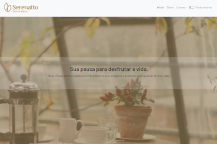

<h1 style="text-align: center"> Projeto de Portfolio</h1>
<h2> 📰 Sobre</h2>

## Projeto  do curso de Bootstrap 5: Novos recursos e práticas recomendadas de HTML, CSS e JavaScript! Da Alura

Projeto da página web para a Cafeteria Serenatto.

Projeto contendo várias funcionalidades como a de **modo noturno**, o efeito visual **parallax** com HTML e CSS. Além de vários cards contendo um componente novo: o **off-canvas**.

Também incluímos outro componente diferente, o **accordion**, além de mais elementos como, por exemplo, o **moda**l e o **formulário**.

Por fim, construímos um **rodapé** com os ícones da biblioteca do **Bootstrap**.

<h2> 🚀 Tecnologias</h2>

 
    
    
    
    

<h2> 📞 Contato</h2>

 
  
  
   
  
  

  
## Link do Projeto

- [Clique e confira](https://misael1981.github.io/cafeteria-serenatto/)
